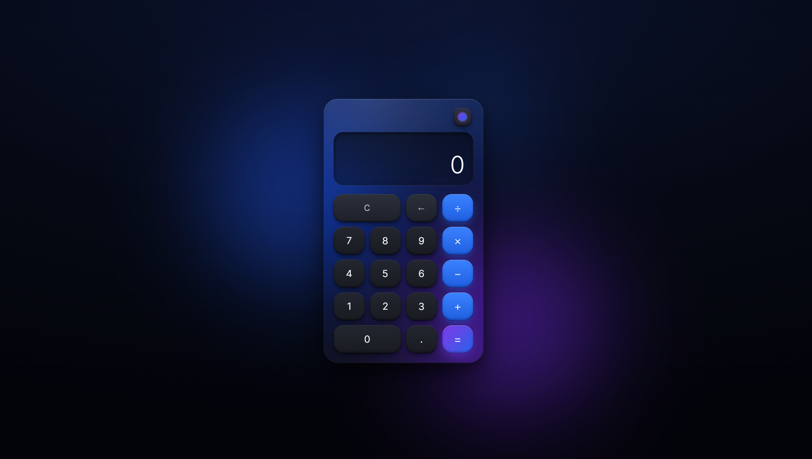
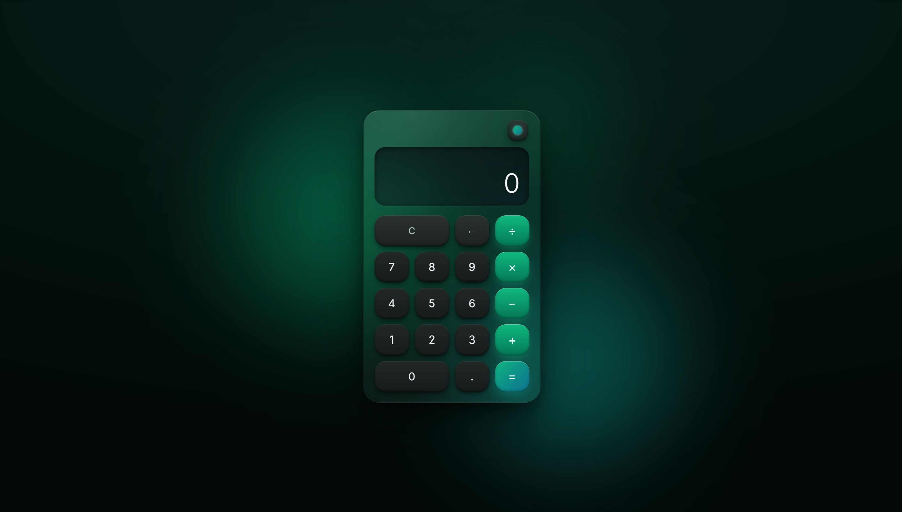
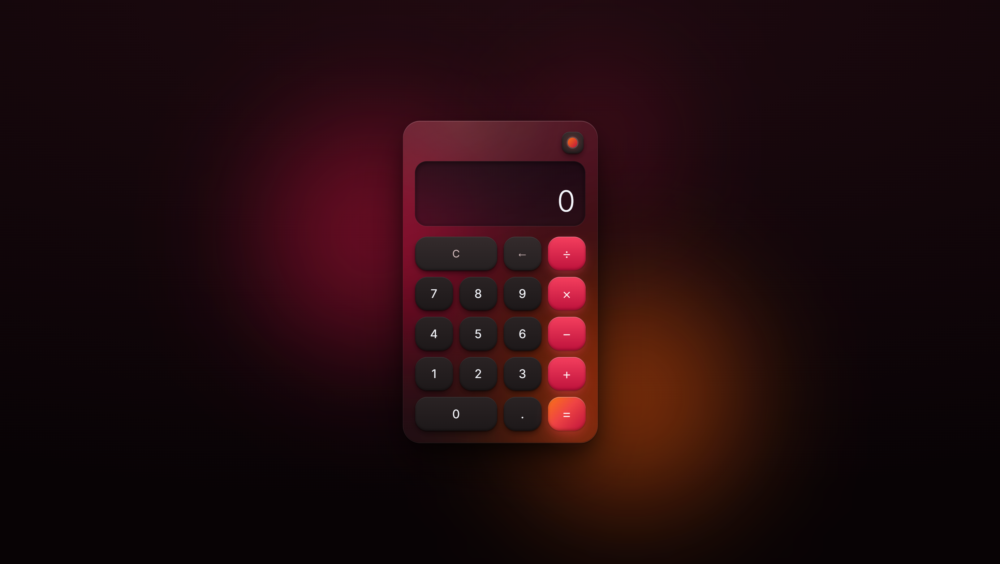
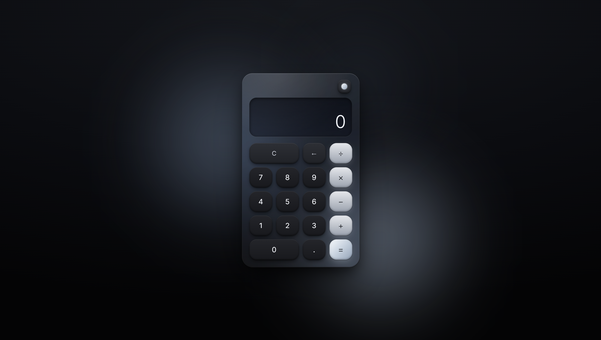

# Exercise - Glassmorphism Calculator

A dark-themed calculator with a glassmorphism card, soft ambient lighting and a keyboard-friendly interface, built with HTML, CSS and vanilla JavaScript.

## Usage
Open `index.html` in a browser.

The calculator works with mouse, touch and keyboard: digits, `+ - * /`, `Enter` to get the result, `Backspace` to delete the last digit and `Esc` to clear.

## Technologies
* JavaScript
* HTML
* CSS

# Screenshots

